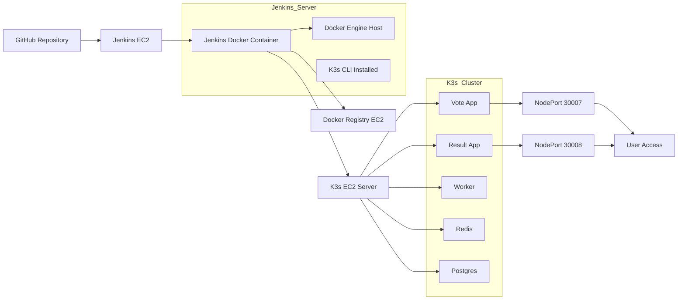

Voting App – End-to-End CI/CD with Jenkins, Docker & K3s

This project is a hands-on implementation of a complete CI/CD pipeline using three EC2 instances.

The idea is simple:
Whenever code is pushed, Jenkins builds Docker images, pushes them to a private registry, and deploys everything into a Kubernetes cluster (K3s).

🧱 Setup Overview

I used 3 EC2 instances:

1. Jenkins Server
Jenkins runs inside Docker
Docker is installed (used for building images)
K3s CLI is also installed (for Kubernetes interaction if needed)
2. Docker Registry Server
Runs a private Docker registry
Stores all built images
3. K3s Server (Kubernetes)
Lightweight Kubernetes cluster (K3s)
All application deployments happen here

                           
🔁 Flow (What Actually Happens)

Jenkins pulls the latest code from GitHub
Builds Docker images (vote, result, worker)
Pushes them to private registry
Copies Kubernetes manifests to K3s server
Applies them using kubectl
App becomes live via NodePort

## 🏗️ Architecture Overview

⚙️ Jenkins EC2 Setup
                           
Install Docker
sudo apt update
sudo apt install -y docker.io
sudo systemctl enable docker
sudo systemctl start docker
sudo usermod -aG docker ubuntu
Run Jenkins inside Docker
docker run -d \
  --name jenkins \
  -p 8080:8080 -p 50000:50000 \
  -v jenkins_home:/var/jenkins_home \
  -v /var/run/docker.sock:/var/run/docker.sock \
  jenkins/jenkins:lts

👉 Mounting /var/run/docker.sock is important so Jenkins can use Docker.

Install Docker CLI Inside Jenkins Container

Sometimes Jenkins container does not have Docker CLI.

You can install it manually:

docker exec -it jenkins bash
apt update
apt install -y docker.io

Verify:

docker ps

Install K3s (inside Jenkins EC2)

Even though deployment happens on another EC2, I installed K3s tools here as well:

curl -sfL https://get.k3s.io | sh -

Check:

kubectl get nodes
Jenkins Access
http://<Jenkins-Public-IP>:8080

Get password:

docker exec jenkins cat /var/jenkins_home/secrets/initialAdminPassword

                           
📦 Docker Registry EC2 Setup

Run a private registry:

docker run -d \
  -p 5000:5000 \
  --restart always \
  --name registry \
  registry:2
Allow Insecure Registry (IMPORTANT)

On Jenkins EC2:

sudo nano /etc/docker/daemon.json

Add:

{
  "insecure-registries": ["<Registry-IP>:5000"]
}

Restart Docker:

sudo systemctl restart docker

                           
☸️ K3s EC2 Setup

Install K3s:

curl -sfL https://get.k3s.io | sh -

Check cluster:

sudo kubectl get nodes

                           
🔐 SSH Setup (Jenkins → K3s)

Copy your .pem key into Jenkins container:

docker cp k8.pem jenkins:/var/jenkins_home/
docker exec jenkins chmod 400 /var/jenkins_home/k8.pem

                           
⚙️ Jenkins Pipeline
pipeline {
    agent any

    stages {
        stage('Clone') {
            steps {
                deleteDir()
                git branch: 'main', url: 'https://github.com/WasSid-998/Vote-app-project-new.git'
            }
        }

        stage('Build Images') {
            steps {
                sh '''
                docker build -t <Registry-IP>:5000/vote ./vote
                docker build -t <Registry-IP>:5000/result ./result
                docker build -t <Registry-IP>:5000/worker ./worker
                '''
            }
        }

        stage('Push Images') {
            steps {
                sh '''
                docker push <Registry-IP>:5000/vote
                docker push <Registry-IP>:5000/result
                docker push <Registry-IP>:5000/worker
                '''
            }
        }

        stage('Deploy') {
            steps {
                sh '''
                ssh -i /var/jenkins_home/k8.pem ubuntu@<K3s-IP> "rm -rf ~/k8s"

                scp -i /var/jenkins_home/k8.pem -r k8s ubuntu@<K3s-IP>:~

                ssh -i /var/jenkins_home/k8.pem ubuntu@<K3s-IP> "
                sudo kubectl get namespace voting-app || sudo kubectl create namespace voting-app
                sudo kubectl apply -f ~/k8s/ -n voting-app
                "
                '''
            }
        }
    }
}
📁 Kubernetes Files

All manifests are inside k8s/ folder:

namespace.yaml
vote.yaml
result.yaml
worker.yaml
redis.yaml
postgres.yaml
vote-service.yaml
vote-green-deployment.yaml
secret.yaml
                           
🌐 How to Access the App

First, check services:

kubectl get svc -n voting-app

You’ll see something like:

vote-service   NodePort   80:30007/TCP
result-service   NodePort   80:30008/TCP
                           
Now open in browser:

http://<K3s-Public-IP>:30007
🔍 Useful Commands
                           

Check pods:

kubectl get pods -n voting-app

Logs:

kubectl logs <pod-name> -n voting-app

Describe:

kubectl describe pod <pod-name> -n voting-app

                           
💡 Notes
Jenkins is running inside Docker, not directly on EC2
Docker is used both for Jenkins and image builds
K3s is lightweight and perfect for this kind of setup
Private registry avoids using Docker Hub

                           
